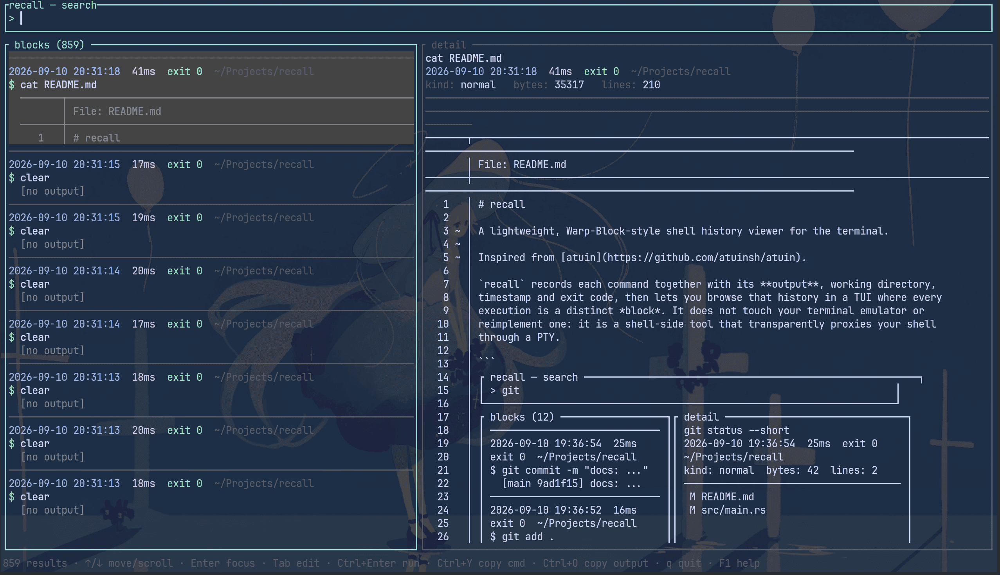

<p align="center">
  
</p>

# recall

[English](README.md) | 简体中文

一个轻量、Warp Block 风格的终端 shell 历史查看器。

灵感来自 [Warp](https://www.warp.dev/)，但它本身是一个独立的 shell 历史与输出
记录工具。

`recall` 会记录每条命令及其**输出**、工作目录、时间戳和退出码，然后让你在一个
TUI 中浏览这些历史——每次执行都是一个独立的 *block*。它不改动你的终端模拟器，
也不重新实现一个：它是一个 shell 侧工具，通过 PTY 透明地代理你的 shell。

<p align="center">
  
</p>

## 安装

### 一行安装（推荐）

```sh
curl -fsSL https://raw.githubusercontent.com/wendaining/recall/master/install.sh | sh
```

安装脚本会自动识别 Linux 或 macOS 及当前 CPU 架构，从最新的 GitHub Release
下载对应二进制文件并校验 SHA-256。随后它会：

- 将 recall 安装到 `/usr/local/bin` 或 `~/.local/bin`；
- 为 zsh、bash 或 fish 配置自动输出捕获与搜索快捷键；
- 在正确位置创建默认 `config.toml`，已有配置不会被覆盖；
- 检测已有 bash、zsh、fish 与 atuin 历史，并逐项询问是否导入；
- 在新的交互式 shell 中自动启动 PTY 代理，无需修改终端模拟器设置。

默认会自动捕获输出。若只需要搜索快捷键和元数据，可设置
`RECALL_PROXY_SETUP=hooks`，需要捕获输出时再运行 `recall shell`。旧值 `shell`
和 `none` 分别兼容映射为 `auto` 与 `hooks`；显式 `terminal` 模式仅为已有的
终端托管配置保留。`RECALL_IMPORT_HISTORY` 可设为 `yes`、`no` 或 `ask`。

### Windows 一行安装

```powershell
irm https://raw.githubusercontent.com/wendaining/recall/master/install.ps1 | iex
```

脚本会下载最新 Release、校验 SHA-256，并把 `recall.exe` 安装到
`%USERPROFILE%\.local\bin`（可用 `RECALL_INSTALL_DIR` 覆盖），把该目录加入用户
`PATH`，为 `$PROFILE` 配置自动输出捕获，并创建默认 `config.toml`。设置
`RECALL_NO_MODIFY_PROFILE` 可跳过修改 profile，设置 `RECALL_PROXY_SETUP=hooks`
可只安装 hooks。安装器也会询问是否导入检测到的 shell 与 atuin 历史；可用
`RECALL_IMPORT_HISTORY=yes|no|ask` 控制。

### 从源码构建

```sh
cargo build --release
install -Dm755 target/release/recall ~/.local/bin/recall      # Linux/macOS
```

Windows 上二进制为 `target\release\recall.exe`，把它复制到 `PATH` 中的目录即可。

### 更新

```sh
recall update
```

`recall update` 会下载当前平台的最新稳定版 GitHub Release，展示下载进度、校验
SHA-256，然后替换正在运行的二进制。使用 `recall update --check` 仅检查更新。
历史 TUI 每 24 小时最多检查一次稳定版更新，并在状态栏显示更新提示。

### 卸载

```sh
curl -fsSL https://raw.githubusercontent.com/wendaining/recall/master/uninstall.sh | sh
```

```powershell
irm https://raw.githubusercontent.com/wendaining/recall/master/uninstall.ps1 | iex
```

卸载脚本会删除二进制文件，以及安装脚本管理的 shell 配置块；你的配置文件和命令
历史会保留。如果安装时指定了自定义 `RECALL_INSTALL_DIR`，卸载时也要传入相同变量。

## 特性

- **输出捕获**：通过 PTY 代理，颜色、`isatty` 判断和交互式程序都保持正常。
- **Block UI**：每次执行是一个 block，带分隔线、元信息头、命令行和输出预览。
- **搜索**：同时搜索命令*和*输出（SQLite FTS5 + trigram 分词器，支持中文子串搜索）。
- **复制**：通过可插拔后端把选中的命令或输出复制到剪贴板（Wayland `wl-copy`、
  X11 `xclip`/`xsel`、原生 `arboard`，或 SSH/tmux 下的 OSC 52）。
- **重跑**：直接在 TUI 中重新执行选中的命令。
- **历史导入**：可迁移 bash、zsh、fish、PowerShell，或可选的 atuin 历史；
  它们都不是 recall 的运行时依赖。
- **合理的边界处理**：无输出、交互式/全屏、二进制、被重定向的命令都会被分类标记，
  而不是被悄悄弄乱。
- **密钥过滤**与**保留策略**：明显的密钥会被丢弃，存储的输出默认 30 天后过期。

## 环境要求

- Linux、macOS，或 Windows 10 1809+（Windows Terminal + PowerShell）
- Rust（用于构建）——基于 Rust 1.88+ 开发
- SQLite 已内置，无系统依赖
- Linux/macOS 用 zsh、bash 或 fish；Windows 用 PowerShell 7 或 Windows
  PowerShell 5.1 做 shell 集成

## 安装配置

> [!note]
>
> 一行安装脚本会自动完成 shell 集成并创建默认配置。下面的手动步骤主要用于源码
> 构建或自定义安装。

### 1. 统一 Shell 设置

如果是从源码构建，请运行对应 shell 的设置命令：

```sh
recall setup zsh       # 也可以是 bash、fish、pwsh、powershell
```

默认会启用自动输出捕获。recall 在启动文件顶部写入一小段托管的代理启动逻辑，
并在末尾加载集成。外层 shell 会在读取其余配置前交给 PTY 代理；代理中的子 shell
只加载一次用户配置，并在主题、prompt 和 PSReadLine 就绪后安装 hooks。

如果只需要搜索快捷键和元数据，不希望自动启动代理：

```sh
recall setup zsh --mode hooks
```

`recall init` 仍作为完全手动配置的底层接口：

```zsh
# ~/.zshrc
eval "$(recall init zsh)"
```

```bash
# ~/.bashrc
eval "$(recall init bash)"
```

```fish
# ~/.config/fish/config.fish
recall init fish | source
```

```powershell
# $PROFILE
recall init pwsh | Out-String | Invoke-Expression
```

集成会安装命令边界钩子，以及一个 **Alt+R** 组件：打开 TUI 并把选中的命令插入到提示符。
按键由配置里的 `[ui].search_key` 决定，详见下文。

#### 设置快捷键

按键在 `~/.config/recall/config.toml` 中以语义化名称配置，由 `recall init`
按不同 shell 转换：

```toml
[ui]
search_key = "alt-r"   # 可选 alt-r、ctrl-t，或组合键 "ctrl-x ctrl-r"
```

支持的写法有 `alt-<字母>`、`ctrl-<字母>`，或用空格分隔的组合键（如
`"ctrl-x ctrl-r"`）。默认是 `alt-r`。修改后重开 shell（或重新执行
`eval "$(recall init zsh)"`）即可生效。PSReadLine 只绑定单个 chord，因此在
Windows 上组合键只会取其第一个键。

#### macOS 的 Option 键

Mac 键盘没有 `Alt`，对应的是 `Option`（`⌥`）。recall 同时支持原生
`Option+R` 输入的 `®` 与 `Meta-R` 序列，macOS 终端保持默认设置即可打开搜索组件。
将 Option 设为 Meta 会保留终端惯例中的 `Alt+R` 兼容性：

| 终端 | 设置项 |
| --- | --- |
| Terminal.app | 设置 → 描述文件 → 键盘 → *将 Option 键用作 Meta 键* |
| iTerm2 | Preferences → Profiles → Keys → *Left Option Key: Esc+* |
| Ghostty | `macos-option-as-alt = true` |

也可以换一个按键，例如 `"ctrl-x ctrl-r"`（安装脚本在 macOS 上会提供该选项）。
运行 `recall doctor` 可确认 shell 集成和 `PATH` 状态。

未使用代理时，recall 仍会在后台记录命令元数据。要捕获输出，需要让 shell 运行在
代理之下。

### 2. 使用 PTY 代理捕获输出

安装脚本和 `recall setup` 会自动在 recall 的 PTY 代理中启动原本使用的 shell，
无需配置终端模拟器。在启动新 shell 前设置 `RECALL_PROXY=0`，可以跳过自动捕获，
同时保留搜索和元数据 hooks。

在 hooks-only 或完全手动配置中，需要捕获输出时可启动被包裹的 shell：

```sh
recall shell
```

已有的终端托管配置可以继续直接启动 recall，但这只是兼容用的高级方式：

```
# 在你的终端模拟器配置文件中
shell /home/you/.local/bin/recall shell
```

如果终端不是 TTY、设置了 `RECALL_PROXY=0`，或代理启动失败，`recall shell`
会回退到普通 shell。

macOS 上代理会以登录 shell 启动（`zsh -l`），从而加载 `~/.zprofile` 和
Homebrew 等初始化。可用 `--no-login` 或 `proxy.login_shell = false` 关闭。代理
还会把自身所在目录加到子进程 `PATH` 最前面，所以即使终端在 profile 加载前就
启动了 `recall shell`，`recall init` 钩子也能正常工作。如果会话产生了输出却没有
任何命令标记，代理会在退出时给出提示。

Windows 上代理通过 ConPTY 运行 shell。未设置 `proxy.shell` 和 `--shell` 时，
它会沿父进程链检测你启动 `recall shell` 时所用的 shell，再依次回退到 `pwsh`、
`powershell`、`%COMSPEC%`。可用 `--shell` 或 `proxy.shell` 覆盖，例如
`recall shell --shell cmd`。macOS 专用的 `-l` 登录参数不会在 Windows 上传入。

### 3. 导入已有历史（可选）

```sh
recall import history zsh
recall import history bash --path ~/archives/bash_history
recall import history fish
recall import history pwsh

recall import atuin             # 可选适配器；无需安装 atuin
recall import atuin --days 30
recall import atuin --path /path/to/history.db
```

不传 `--path` 时，recall 会使用对应 shell 的标准历史路径，或 atuin 的标准数据库
路径。导入的 block 只有元数据、没有输出。通用来源记录让重复导入保持幂等，同时会
保留代表不同执行次数的重复命令。

## 使用

用 `recall`（或 Alt+R 组件）打开 TUI。直接输入即可搜索；在 TUI 内按 `F1`
查看完整的按键说明。

> [!note]
>
> `Tab` 和 `Ctrl+Enter` 依赖 shell 组件（`recall search --cmd-only`）。
> `Ctrl+Enter` 需要终端模拟器能区分上报；否则请用 `Ctrl+E`（Windows Terminal
> 请用 `Ctrl+E`）。

其他命令：

```sh
recall search --cmd-only   # 打印选择结果（供 shell 组件使用）
recall setup [shell]       # 配置自动捕获和 shell hooks
recall doctor              # 诊断配置、数据库和剪贴板
recall prune               # 清理超过保留期的输出
recall config path|show|default
recall uuid
```

## 配置

> [!IMPORTANT]
>
> 启用代理前，请务必检查配置文件。它直接决定数据库的存储位置、哪些命令输出会被
> 记录、密钥过滤、数据保留期限和剪贴板行为。默认配置可以直接运行，但主动配置能
> 避免长期保存大量无用输出或敏感内容。可使用 `recall config path`、
> `recall config show` 和 `recall config default` 分别查看配置路径、当前生效配置和
> 完整配置模板。

Linux/macOS 为 `~/.config/recall/config.toml`，Windows 为
`%APPDATA%\recall\config.toml`（所有字段均可选；`recall config default`
会打印完整示例）。`RECALL_CONFIG` 可覆盖路径。Windows 上数据库默认位于
`%LOCALAPPDATA%\recall\recall.db`。

```toml
[general]
max_output_bytes = 1048576   # 单条命令输出上限（压缩前）
strip_ansi = true

[proxy]
login_shell = true           # 以 -l 启动 shell（macOS 默认开启）
mark_interactive = true      # 跳过全屏程序的输出
secrets_filter = true

[retention]
retention_days = 30          # 0 表示不过期
auto_prune = true

[clipboard]
backend = "auto"             # auto | arboard | osc52 | wl-copy | xclip | xsel

[ui]
search_key = "alt-r"         # 打开 recall 的按键（alt-r、ctrl-t、"ctrl-x ctrl-r"）
list_width_pct = 42          # 列表面板初始宽度；在 TUI 中调整后会持久化
```

## 工作原理

```
终端模拟器 ──▶ recall proxy (PTY/ConPTY) ──▶ shell (zsh/bash/fish/pwsh)
              │  字节流：捕获的输出 + 带内 OSC 标记
              ▼
       recall.db (SQLite, WAL)  ◀── recall TUI
```

- 代理在 PTY（Windows 上为 ConPTY）上启动你的 shell，并双向转发字节，因此终端
  体验保持不变。
- shell 集成在命令执行前以私有 OSC 序列（`ESC ] 9999 ; {...} BEL`）写入带内起始
  标记，携带 `{command, cwd, start}`；并在下一个提示符绘制前写入带退出码的结束标记。
- 代理解析并剥离这些标记，因此命令边界精确，提示符永远不会被捕获。没有旁路通道
  或 socket，这让 recall 与 shell、操作系统无关。
- 输出经过去 ANSI、分类、限长、zstd 压缩后，与完整命令元数据一起存入 SQLite。
  可选导入的来源关系保存在独立、与具体来源无关的记录表中。

## 兼容性

recall 与终端无关：它使用标准 ANSI/OSC 序列，并用 crossterm 渲染，因此任何兼容 VT
的终端都能运行。唯一的终端差异是剪贴板支持，以及能否区分上报 `Ctrl+Enter`
（回退键是 `Ctrl+E`）。

| 平台 | Shell | 终端模拟器 | 说明 |
| --- | --- | --- | --- |
| Linux | zsh, bash, fish | 任意兼容 VT（Konsole、GNOME Terminal、Ghostty 等） | 完整支持 |
| macOS | zsh, bash, fish | 任意兼容 VT（Terminal.app、iTerm2、Ghostty 等） | Terminal.app：用 `pbcopy` 复制，用 `Ctrl+E` 执行 |
| Windows | PowerShell 7、Windows PowerShell 5.1 | Windows Terminal（ConPTY） | 剪贴板走原生 `arboard`/`clip`；用 `Ctrl+E` 执行 |

剪贴板后端会自动选择：`wl-copy`（Wayland）、`xclip`/`xsel`（X11）、`pbcopy`（macOS）、
`clip`（Windows），然后是原生 `arboard`，最后是 OSC 52。

## 已知限制

- **重定向的输出无法捕获。** `cmd > file` 不会经过终端，代理看不到；这类 block 会
  被标记为不可用。Warp 也有同样的限制。
- 命令窗口之外产生的输出（例如后台任务）不会归属到某个 block。
- 必须由代理包裹 shell；普通 shell 只能记录元数据。
- 密钥检测是尽力而为。

## 开发

```sh
cargo build
cargo test
cargo fmt
cargo clippy --all-targets
```

架构与约定见 `AGENTS.md`。

## 许可证

MIT
